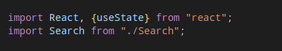
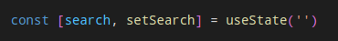
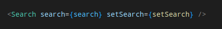
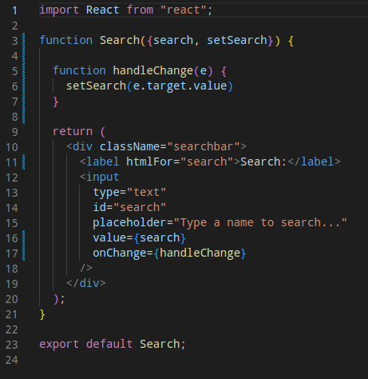

**Vanilla JS..Then what?**

After working with vanilla JS it was time to move onto React. I must confess I certainly prefer React..I'm still quite new on this journey to becoming a professional developer but it felt like an important step to recognize how I will need to learn to adapt and look for tools that might fit me better. I hope that evolution will lead to interleaving and make me stronger as I progress even though it feels overwhelming right now.

I really like the idea of declarative programming over imperative programming. With reusable components it also feels like playing with legos. React seems to emphasize that principle and makes coding more enjoyable once you get the syntax and flow down. After you have that down you just have to figure out where you want to put those "lego pieces" in your project.

**My first Lego set - Search**

The concept started to click when I put together the Search feature for a lab/project I was working on. The Search feature involves the use of controlled components. You need to control an input and sync/connect it to a state variable. That way, the program knows what you're typing into the search input as you type it and you can use the filter method to compare it to the dataset you want to search in.

I will be guiding through the creation of a simple search bar for a React S.P.A (single page app).

First you need to create a state variable and import the search component in the lowest common ancestor component (L.C.A). In this case, the L.C.A is usually App.js but can also be named SomethingElse.js

To be able to create a state variable you will need to hook in useState:

After hooking in useState you will be able to create a state variable and pass it down to your search component as a prop. Remember to declare your state variable inside your components function and the search component and props go inside the functions return.

Your search component should then look something like this:

You "gain control" via the value={ } and onChange event. The onChange event invokes the handleChange callback function which in turn uses the state setter function (setSearch) passed down to the search component. You could test this out by adding a console.log(e.target.value) to handleChange. You should see your console capturing everything you type in the search input.

Once you have this working you need to make the search magic happen by implementing the logic to compare your search to the data you want to searh. So head back over to your L.C.A and craft your search criteria.
